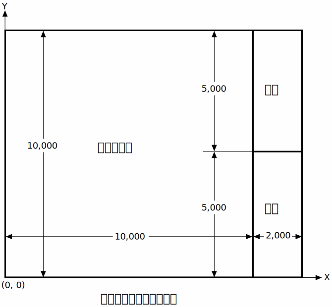

---
# simepidemic HTTP Server版仕様書 ver. 1.0
著者：畝見達夫，作成：令和2年9月1日，編集：9月28日

このドキュメントでは，感染シミュレータ SimEpidemic の HTTP server 版における，起動オプション，クライアントとの間のプロトコル等の仕様について述べる。

[toc]

## サーバプロセスの起動と終了
サーバソフトウェアは macOS 10.14 以降で動作するコマンドライン・アプリケーションである。
UNIX の標準的な起動方法によりバックグラウンドで実行することを想定している。
終了させるには，kill *pid* コマンド等によりプロセスに TERM シグナルを送る。
実行モジュールの標準的なファイル名は `simepidemic` である。

### コマンドオプション

* -d, --directory *パス* :
HTML などのファイルが格納されているディレクトリのパス。
`/` で始まる絶対パスあるいは、`simepidemic` コマンドを起動したときの作業ディレクトリからの相対パス。
既定値はコマンド起動時の作業ディレクトリ。サーバプロセスによる読み込みが可能でなければならない。
* -D, --dataStorage *パス* :
サーバが使う情報記録用のファイルを格納するディレクトリのパス。
`/` で始まる絶対パスあるいは、`simepidemic` コマンドを起動したときの作業ディレクトリからの相対パス。
既定値はコマンド起動時の作業ディレクトリ。サーバプロセスによる読み込みと書き込みが共に可能でなければならない。
* -f, --format *n* :
[JSON フォーマットオプション](#JSONForm)の既定値を指定する。
このオプションを指定しない場合の既定値は 0。
* -n, --maxNDocuments *n* : サーバで扱う世界の最大数。既定値は 128。
* -p, --port *ポート番号* : HTTP サーバのポート番号を指定する。既定値は 8000。
* -r, --maxRuntime *s* : 秒数で表す最長実行時間。
既定値は 172,800 つまり2日間。実行開始からこの時間が経過したときに引き続きまだ実行中の場合は強制的に停止する。
* -s, --maxPopSize *n* : 許容される人口の最大数。既定値は 1,000,000。
* -t, --documentTimeout *s* : 秒数で表す世界の保持期限。
既定値は 1,200 つまり20分間。最後の動作・操作からこの時間が経過した時点で世界を閉じる。
実行中の場合は，実行の終了後からの時間となり，終了後に操作が行われればさらに延長される。
* --version : ソフトウェアのバージョンを表す文字列を表示し終了する。

ポートを他のプロセスが使用していたり，サーバプロセスの停止から数秒以内に再起動した場合などでポートの
確保に失敗すると，即座に停止し終了コード 2 を返す。

例：ポート番号 8001番を使用し、JSONのフォーマットに段つけと辞書キーのソートを指定して、
バックグラウンドで実行を開始する。

	$ simepidemic -p 8001 -f 3 &

サーバプロセスを起動したマシンで Webブラウザから
 http://localhost:*ポート番号*/ へアクセスすると，
`index.html `があれば，その内容が描画される。

### ログ
UNIX の syslog 機能の拡張である macOS の os_log を利用して，実行状況の記録を取る。
どのレベルのログをどのファイルに残すかは稼働するシステムの設定による。

## HTTP 要求と応答
クライアント側からの要求にサーバが応答する。
クライアントはエンドユーザに対してGUIなどの操作・表示手段を提供するものであり，
javascript 等で書かれたコードにより制御されるWEBブラウザ等を想定する。
多くのブラウザでは，HTTPプロトコルに規定されるいくつかのヘッダが自動的に構成されるため，
以下ではプロトコルの詳細は省略し，ブラウザ上で動くプログラムの開発に必要な情報だけを記述する。

[パラメータ設定](#SetParams)や[実行制御](#Control)など，応答としてデータを返す必要のない要求に
対しては，サーバは `text/plain` 型のエラー等の情報を示すデータを返す。
特に以下の説明で記述がない場合データは `OK` のみである。 

シミュレータへの要求コマンドではなく、`.html`，`.css`，`.js`，`.jpg`
などのファイル拡張子を伴うパスが指定された場合は．
該当するファイルがホスト側に存在すれば，通常の WEB サーバと同様その内容を応答する。
ただし，動画や音声などのためのストリーミングによる発信は実装されておらず，
これらのファイルを指定した場合は 415 (Unsupported Media Type) エラーになる。
`.cgi` や `.php` などのサーバサードプログラムも同様のエラーになる。
サーバのトップディレクトリ `/` の `GET` 要求に対しては、`index.html` ファイルが存在すれば，
その内容を応答する。
これらのファイルは，既定値では `simepidemic`
コマンドが起動された状態での作業ディレクトリ下にあるものと仮定される。
ディレクトリの位置は [コマンドライン・オプション `-d`](#ComOptDirectory) で指定可能である。

## シミュレーション世界の生成と消去
1つのシミュレーション環境に対応する *世界* は，
アクセス元のブラウザまたは IP アドレス1つにつき1つが既定値として割り当てられる。
1つの世界を複数のアクセス元から操作したり，1つのアクセス元での複数の世界の操作を可能とするため，
各世界には固有の文字列で表現される *世界ID* が割り当てられ，
操作時にこの世界IDを指定することで，対象となる世界を特定する。
次節以降で述べるパラメータ設定などは，すべて指定されたあるいは既定値の世界に対して実行される。
複数の世界を同時に扱うのでなければ，既定値として割り当てられた世界を用いればよいので，
新たに世界を生成する必要はない。

無用な世界の増加を防ぐため，最後の操作または動作から 一定時間が経過した時点で，
世界を閉じデータを消去する。時間の既定値は20分であるが，[サーバ起動時のコマンドオプション](#RunAndQuit)
`-t` または `--documentTimeout` で指定することができる。
その後に同じブラウザまたは IP アドレスからの既定値世界に対する操作の要求があった場合は，
新たに世界が生成される。すでに消去された世界IDを伴う操作要求はエラーになる。
> ブラウザの区別は既定値の世界に対するコマンドの問い合わせの中に
> me=*文字列* を含めることで実現される。
> *文字列* は，他と重複のない適当な文字列でよい。
> この情報がない場合はアクセス元の IP アドレスで代替されるが，
> NAT ルータを介した IP マスカレード等により，サーバ側から見た場合，
> 複数のマシンが同じ IP アドレスを共有する場合があるため注意が必要である。

### 既定値の世界IDの取得 `GET /getWorldID`
* me=[*ブラウザID*](#World) *省略可*

既定値世界の ID を表す文字列をテキスト `text/plain` として応答する。
得られた 世界ID を使って，既定値の世界を他のマシンから操作することができる。
### 世界の生成 `GET /newWorld`
新たな世界を1つ生成し，その世界 ID を表す文字列をテキスト `text/plain` として応答する。
### 世界の消去 `GET /closeWorld`
* world=[*世界ID*](#World) *必須*

指定された世界IDを持つ世界を消去する。ただし，既定値世界は消去できない。

## パラメータ値の取得と設定
### パラメータ値の取得 `GET /getParams`
* save=*ファイル名* *省略可*
このオプションが添えられた場合は，ダウンロード形式で応答する。
* format=[*JSONフォーマットオプション*](#JSONForm) *省略可*
* me=[*ブラウザID*](#World) *省略可*
* world=[*世界ID*](#World) *省略可*

[パラメータ名](#ParamNames) をキー，設定するパラメータ値を値とする辞書形式の JSON データが応答される。

例：JSON の辞書形式のデータを myParams.json に保存する。

	<form method="get" action="getParams" target="saveResult">
	<input type="hidden" name="format" value=0>
	<input type="text" name="save" value="myParams">
	<input type="submit" value="保存">
	</form>
	応答: <iframe name="saveResult" height=20></iframe>

### パラメータ値の設定 `POST /setParams`
シミュレーションを実行するときに使われるパラメータ値を設定する。
パラメータは，*世界*，*発症機序*，*対策*，*検査* の4種類に分類される。
詳細は，[パラメータ名と型](#ParamNames)を参照。
このうち世界に分類されるパラメータは，シミュレーション開始前でなければ適用できない。
シミュレーションの途中で世界パラメータの設定を行うと，新たに指定された値は予約として記録され，
次に[世界を初期化](#Control)したときに反映される。
#### 積載情報: `Content-type: multipart/form-data`
[パラメータ名](#ParamNames) をキー，設定するパラメータ値を値とする
辞書形式の JSON データのパートを含まなければならない。このパートのヘッダは例えば，

	Content-Disposition: form-data; name="ABCDFEG"; filename="myParams.json"
	Content-Type: application/json

のような形式である。ここで "ABCDEFG" は [*世界ID*](#World) を表す文字列である。
文字列が `"default"` の場合は，既定値世界が操作の対象となる。

例：ユーザが指定したファイルからパラメータを読み込み，"ABCDEFG" というIDを持つ世界に設定する。
	
	<form method="post" action="setParams"
	  enctype="multipart/form-data" target="loadParamResult">
	<input type="file" name="ABCDEFG" accept="application/json">
	<input type="submit" value="読み込む">
	</form>
	応答: <iframe name="loadParamResult"></iframe>

#### 積載情報: `Content-type: application/x-www-form-urlencoded`
* [*パラメータ名*](#ParamNames)=*パラメータ値* *必須* 複数指定可。
* me=[*ブラウザID*](#World) *省略可*
* world=[*世界ID*](#World) *省略可*

例：初期人口と世界の広さを設定する。
	
	<form method="post" action="setParams">
	<table>
	<tr><td align="right">人口</td>
		<td><input type="number" name="populationSize"></td></tr>
	<tr><td align="right">世界の大きさ</td>
		<td><input type="number" name="worldSize"></td></tr>
	</table> 
	<input type="submit" value="設定"/>
	</form>

## パラメータ名と型
分布は最小値，最大値，最頻値の３つの数の組で表現され，
JSON形式では３つの要素からなる配列で表現される。

| パラメータ名 | 日本語名 | 分類 | 型 | 単位 | 既定値 | 範囲 | 備考 |
| ---- | ---- | ---- | ---- | ---- | ---: | ---- | ---- |
| `populationSize` | 初期人口 |  世界 | 整数 | 人 | 10,000 | 100 - 任意 |
| `worldSize` | 世界の大きさ | 世界 | 整数 | 距離単位 | 360 | 10 - 任意 | 一辺の長さ |
| `mesh` | メッシュ | 世界 | 整数 | - | 18 | 1 - 999 | 縦横の各分割数 |
| `stepsPerDay` | 1日当たりステップ数 |  世界 | 整数 | ステップ | 4 | 1 - 999 |
| `initialInfected` | 初期状態での感染者数 |  世界 | 整数 | 人 | 4 | 1 - 999 |
| `mass` | 質量 | 移動 | 実数 | % | 50., | 10., - 100. | 個体加速度の係数 |
| `friction` | 摩擦 | 移動 | 実数 | % | 50., | 0., - 100. | 個体速度の減衰係数 |
| `avoidance` | 衝突回避 | 移動 | 実数 | % | 50., | 0., - 100. | 個体間の斥力 |
| `infectionProberbility` | 感染確率 | 発症機序 | 実数 | % | 80., | 0. - 100. |
| `infectionDistance` | 感染距離 | 発症機序 | 実数 | 距離単位 | 3., | 1. - 20. |
| `contagionDelay` | 感染性の遅れ | 発症機序 | 実数 | 日 | 0.5 | 0. - 10. | 感染からの期間 New! |
| `contagionPeak` | 感染性のピーク | 発症機序 | 実数 | 日 | 3.0 | 0. - 10. | 感染からの期間 New! |
| `incubation` | 潜伏期間 | 発症機序 | 分布 | 日 | [1.,14.,5.] |
| `fatality` | 発症から死亡まで | 発症機序 | 分布 | 日 | [4.,20.,16.] |
| `recovery` | 快復開始まで | 発症機序 | 分布 | 日 | [4.,40.,10.] |
| `immunity` | 免疫有効期間 | 発症機序 | 分布 | 日 | [30.,360.,180.] |
| `distancingStrength` | 社会的距離の強さ | 対策 | 実数 | % | 50. | 0. - 100. |
| `distancingObedience` | 社会的距離協力率 | 対策 | 実数 | % | 20. | 0. - 100. |
| `mobilityFrequency` | 移動頻度 | 対策 | 実数 | ‰ | 50. | 0. - 100. |
| `mobilityDistance` | 移動距離 | 対策 | 分布 | % | [10.,80.,30.] | | 世界の大きさとの比 |
| `gatheringFrequency` | 集会の頻度 | 対策 | 実数 | 個/面積/日 | 50. | 0. - 100. |  New! |
| `gatheringSize` | 集会の大きさ | 対策 | 分布 | 距離単位 | [10.,100.,20.] | | New! |
| `gatheringDuration` | 集会の持続時間 | 対策 | 分布 | 時間 | [10.,168.,24.] | | New! |
| `gatheringStrength` | 集会の強さ | 対策 | 分布 | % | [0.,100.,50.] | | New! |
| `contactTracing` | 接触者追跡 | 対策 | 実数 | % | 20. | 0. - 100. | 捕捉率 |
| `testDelay` | 検査の遅れ | 検査 | 実数 | 日 | 1. | 0. - 10. |
| `testProcess` | 処理期間 | 検査 | 実数 | 日 | 1. | 0. - 10. | 検査から判明まで
| `testInterval` | 検査間隔 | 検査 | 実数 | 日 | 2. | 0. - 10. | 次の検査まで
| `testSensitivity` | 感度 | 検査 | 実数 | % | 70. | 0. - 100. |
| `testSpecificity` | 特異度 | 検査 | 実数 | % | 99.8 | 0. - 100. |
| `subjectAsymptomatic` | 疑症状検査対象者 | 検査 | 実数 | % | 1. | 0. - 100. |
| `subjectSymptomatic` | 有症状検査対象者 | 検査 | 実数 | % | 99. | 0., - 100. |

## 対話型の実行制御
シミュレーションの実行の
開始，停止，および，初期化のコマンド１つを，
要求行に入れた `GET` メソッドによりクライアントからサーバへ指示する。
サーバからの応答として，問題がなければ OK がテキストとして返る。
以下の3つコマンドでは共通して操作対象の世界を指定するために以下の2つの問い合わせ項目のいずれかを含める。

* me=[*ブラウザID*](#World) *省略可*
* world=[*世界ID*](#World) *省略可*

### 開始: `GET /start`
* stopAt=*n* *省略可* 
実行日数が整数 *n* に到達した時点で停止する。この指定がなければ `stop` 要求があるか，
感染者が 0 になるか，あるいは，サーバ側で許容される[最長実行時間](#RunAndQuit)まで実行が継続される。

### 停止: `GET /stop`
対象の世界が実行中の場合は，実行を中断する。再度，start コマンドを発効すると，
中断された状態から続きの実行が開始される。

### 初期化: `GET /reset`
世界を初期化し，実行前の状態にする。ただし，個体はランダムに再配置されるので，
以前とは異なる配置となり，まったく同じ実行プロセスが再現されることはない。

例：開始，停止、初期化の3つのボタン
		
	<form method="get" target="result">
	<input type="submit" value="開始" formaction="start">
	<input type="submit" value="停止" formaction="stop">
	<input type="submit" value="初期化" formaction="reset">
	</form>
	応答: <iframe name="result" width=100 height=20></iframe>

## 実行の監視と結果の取得
現在のサーバ側での実行の状況あるいは実行開始からの履歴を取得する。
### 数値情報の取得 `GET /getIndexes`
* names=[*統計指標名1*, *統計指標名2*, ...]
*または* *統計指標名*=1 *いずれか必須* :
取得したい数値情報の[統計指標名](#IndexNames)を指定する。後者の形式は複数含めても良い。
* fromStep=*n* *または*
fromDay=*n* *省略可* :
`fromStep` と `fromDay` が共に指定された場合は `fromDay` を優先。
可能なら *n* ステップ（あるいは日）から現在までの履歴を返す。
共に省略された場合，指定されたステップ（あるいは日）が実行済みのシミュレーション期間より先の場合，
および，指標が履歴に対応しない場合は現在の値だけを返す。
*n* が負の場合は現在から |*n* | ステップ（あるいは日）前からの履歴を返す。
履歴は、データが日ごとの場合は日ごと、現在数と累積についてはステップごとの数値の配列になる。
ただし，ステップ数（あるいは日数）が 1,280 を超えると，内部の記録データが2ステップ（あるいは日）
ずつの平均値に置き換えられ，記録される数値の数が半分の 640 に短縮される。
この操作は記録データの数が 1,280 を超えるたびに実行される。
* window=*n* *省略可* :日ごとの値の移動平均の窓幅の日数。
*n* が 0 または，この指定が省略された場合は，現在数または累積を返す。
*n > 1 について未実装。*
* format=[*JSONフォーマットオプション*](#JSONForm) *省略可*
* me=[*ブラウザID*](#World) *省略可*
* world=[*世界ID*](#World) *省略可*

[統計指標名](#IndexNames) をキー，指標値を値とする辞書形式の JSON データが応答される。
 
 例：経過日数と各健康状態の現在の人数を取得し、iframe の内容として格納する。
 
	<form method="get" action="/getIndexes" target="currentIndexes">
	<input type="hidden" name="day" value=1>
	<input type="hidden" name="susceptible" value=1>
	<input type="hidden" name="asymptomatic" value=1>
	<input type="hidden" name="symptomatic" value=1>
	<input type="hidden" name="recovered" value=1>
	<input type="hidden" name="died" value=1>
	<input type="submit" value="現在の人口構成">
	</form>
	<iframe name="currentIndexes"></iframe>

### 分布情報の取得 `GET /getDistribution`
* names=[*統計指標名1*, *統計指標名2*, ...]
*または* *統計指標名*=1 *いずれか必須* :
取得したい分布情報の[統計指標名](#IndexNames)を指定する。後者の形式は複数含めても良い。
* format=[*JSONフォーマットオプション*](#JSONForm) *省略可*
* me=[*ブラウザID*](#World) *省略可*
* world=[*世界ID*](#World) *省略可*

[統計指標名](#IndexNames) をキー，指標値のベクトルを値とする辞書形式の JSON データが応答される。
各ベクトルの第1要素は横軸の最小値，第2要素以降に刻みごとの値が入る。
例えば `{"recoveryPeriod":[4,2,5,10,6,3,0,1]}` は，快復期間の分布が
4日2人，5日5人，6日10人，7日6人，8日3人，9日0人，10日1人であることを表す。
 
例：潜伏期間と快復期間の分布を取得し、iframe の内容として格納する。

	<form method="get" action="/getDistribution" target="distribution">
	<input type="hidden" name="incubasionPeriod" value=1>
	<input type="hidden" name="recoveryPeriod" value=1>
	<input type="submit" value="日数の分布">
	</form>
	<iframe name="distribution"></iframe>

## 統計指標名と型
シミュレーション過程で得られる統計指標には，ステップあるいは日ごとに変化する数値情報と，
過程開始以来の指標の分布を表す分布情報がある。

### 数値情報
指標の性質により，履歴，日ごと，現在数，累積に利用可能性の違いがある。

| 統計指標名 | 日本語名 | 型 | 単位 | 範囲 | 履歴 | 日ごと | 現在数 | 累積 |
| ---- | ---- | ---- | ---- | ---- | ---- | ---- | ---- | ---- |
| `isRunning` | 実行中 | 真偽値 | - | true/false |||◯||
| `step` | ステップ数 | 整数 | - | > 0 |||◯||
| `days` | 経過日数 | 実数 | 日 | > 0 |||◯||
| `susceptible` | 未感染者数 | 整数 | 人 | < 初期人口 | ◯ | ◯ | ◯ ||
| `asymptomatic` | 無症状感染者数 | 整数 | 人 | < 初期人口 | ◯ | ◯ | ◯ ||
| `symptomatic` | 発症感染者数 | 整数 | 人 | < 初期人口 | ◯ | ◯ | ◯ ||
| `recovered` | 快復者数 | 整数 | 人 | < 初期人口 | ◯ | ◯ | ◯ ||
| `died` | 死亡者数 | 整数 | 人 | < 初期人口 | ◯ | ◯ | ◯ ||
| `quarantineAsymptomatic` | 無症状隔離数 | 整数 | 人 | < 初期人口 | ◯ | ◯ | ◯ ||
| `quarantineSymptomatic` | 有症状隔離数 | 整数 | 人 | < 初期人口 | ◯ | ◯ | ◯ ||
| `tests` | 検査数 | 整数 | 人 | < 初期人口 | ◯ | ◯ || ◯ |
| `testAsSymptom` | 発症者検査数 | 整数 | 人 | < 初期人口 | ◯ | ◯ || ◯ |
| `testAsContact` | 接触者検査数 | 整数 | 人 | < 初期人口 | ◯ | ◯ || ◯ |
| `testAsSuspected` | 擬症状者検査数 | 整数 | 人 | < 初期人口 | ◯ | ◯ || ◯ |
| `testPositive` | 陽性者数 | 整数 | 人 | < 初期人口 | ◯ | ◯ || ◯ |
| `testNegative` | 陰性者数 | 整数 | 人 | < 初期人口 | ◯ | ◯ || ◯ |
| `testPositiveRate` | 陽性率 | 実数 | % | 0 - 100 | ◯ | ◯ | | |

### 分布情報
全数累積統計による。
横軸の各値に該当した個体がそれまでに合計何人であったを示すベクトルで表現される。

| 統計指標名 | 日本語名 | 横軸 | 縦軸 | 備考 |
| ---- | ---- | ---- | ---- | ---- |
| `incubasionPeriod` | 潜伏期間 | 日 | 人 | 発症者の内，感染から発症まで |
| `recoveryPeriod` | 快復期間 | 日 | 人 | 発症から快復まで |
| `fatalPeriod` | 生存期間 | 日 | 人 | 発症から死亡まで |
| `infects` | 伝染数 | 人 | 人 | 感染させた人数 |
| `contacts` | 接触者数 | 人日 | 人 | 未実装|

## 個体の位置と健康状態の取得

現在の全個体の位置と健康状態の一覧を取得する。
### 要求 `GET /getPopulation`
* format=[*JSONフォーマットオプション*](#JSONForm) *省略可*
* me=[*ブラウザID*](#World) *省略可*
* world=[*世界ID*](#World) *省略可*

### 応答 `Content-type: application/json`
個体の XY座標と健康状態の種類を表す計3つの整数からなる配列を個体数分含む配列の形式で表現される。
XおよびYの値は，世界の大きさを 10,000 としたときの座標を表す整数。
健康状態は 0=未感染，1=無症状感染，2=発症，3=快復，4=死亡。
世界は*フィールド*，*病院*，*墓地* の3つの領域に分かれており，
フィールドは一辺の長さが 10,000 の正方形で，その右側に病院と墓地が配置される。
病院と墓地は，横 2,000，縦 5,000 の長方形で，病院が上，墓地が下に隣接した配置である。
病院と墓地の中の X座標は 10,000 以上，病院内の Y 座標は 5,000 以上，墓地内のY 座標は 5,000 未満である。
さらに移動中の個体についは，上の3つの整数に加え，目標位置の XY 座標を表す2つの整数と，
移動モードを表す1つの整数が加わった計6個の整数の配列で表現される。
移動モードの値の意味は，0=フィールド内移動，1=入院，2=フィールドから埋葬，3=病院から埋葬，4=退院
である。

例：現在の全個体の位置と健康状態を iframe に取り込む。

	<form method="get" action="getPopulation" target="populationData">
	<input type="submit" value="個体情報">
	</form>
	<iframe name="populationData"></iframe>

人口の大きさに比例してデータサイズが増加する。
サーバからは deflate 形式で圧縮されたデータが送られてくるが，
ほとんどのブラウザでは受け取った時点で圧縮を解いてくれるので，
クライアント側のプログラムは解凍処理を行う必要はない。
サーバから送出されるデータのサイズは人口1万人の場合，48〜58kバイト程度である。

## シナリオの設定
統計指標の変化を調べる条件とパラメータ値変更等の操作の列で表現される *シナリオ* を設定する。
シナリオが実行されるとパラメータ値が変化する。シミュレーション開始時点でのパラメータ値は，
シナリオを設定した時点でのパラメータ値が初期値として記録され，
世界の初期化が行われるたびに，パラメータ値もその記録された値に戻る。
シナリオの設定は，世界が初期状態で停止中のときにだけ適用され，
実行が進んだ状態の場合はエラーになる。
### 要求 `POST /setScenario`
#### 積載情報: `Content-type: multipart/form-data`
シナリオを表現する JSON データを含む。

例：ユーザが指定したファイルからパラメータを読み込み設定する。

	<form method="post" action="setScenario"
		 enctype="multipart/form-data" target="loadScenario">
	<input type="file" name="upload" accept="application/json">
	<input type="submit" value="読み込む">
	</form>
	応答: <iframe name="loadScenario" height=20></iframe>

#### 積載情報: `Content-type: x-www-form-urlencoded`
* scenario=*JSONデータ* *必須* :
設定したいシナリオを表現する JSON データの文字列を指定する。
* me=[*ブラウザID*](#World) *省略可*
* world=[*世界ID*](#World) *省略可*

上記２種類の積載情報のいずれの場合も，シナリオを表現する JSON データが空配列 `[]` である場合は，
シナリオは消去される。

### シナリオのデータ表現
シナリオは複数の，*条件*，*追加感染者数*，または，*操作*を要素とする配列である。

* **条件** : 配列または文字列型で表現される。配列の第1要素は整数，第2要素は文字列である。
条件式は文字列で表現され，条件用の統計指標の値と定数値の大小比較を基本述語とする。
比較演算子は `==`, `!=`, `>`, `>=`, `<`, `<=` の6種類である。
それらを論理和 `OR` または論理積 `AND` で結合し，さらにそれらを入れ子にした式の文字列で表現することもできる。
入れ子の結合関係を明確にするため，式を `()` で囲むことができる。
指標名や演算子の間は空白で区切る。
配列の第1要素の整数は，条件が満たされた場合のシナリオ内の移動先を示す。
整数の値は配列内の0から始まるインデックス番号である。
単独の文字列の場合は，条件が満足されると，配列内のその次の要素に制御が移る。
いずれの場合も，条件が満足されるまでシミュレーションが実行される。
* **追加感染者数** : 整数で表現される。この要素に実行が渡ると，
現在の世界にいる未感染者から指定された人数をランダムに選び，無症状感染者に変更する。
* **操作** : 配列で表現される。配列の第1要素は操作対象のパラメータ名を表す文字列，
第2要素は新たに代入される数値である。
操作可能なパラメータは，[パラメータと型の表](#ParamNames)にある「世界」以外に分類され，実数または整数を型とする
つぎの14のパラメータである。
`infectionProberbility`, `infectionDistance`,
`distancingStrength`, `distancingObedience`, `mobilityFrequency`, `gatheringFrequency`,
`contactTracing`, `testDelay`, `testProcess`, `testInterval`, `testSensitivity`, `testSpecificity`, `subjectAsymptomatic`, `subjectSymptomatic`。

追加感染者数または操作の要素が配列内で連続して存在する場合は，
それらの先頭に制御が移った時点で一気にそれらすべての要素が実行される。
制御がシナリオの最後に達した場合は，それ以上シナリオは実行されない。
世界が初期化された場合は，シナリオの制御は先頭に戻る。

アプリ版の SimEpidemic バージョン 1.6.2 以降では，シナリオを JSON 形式でも保存・読込が可能になっているので、
そのシナリオパネルで編集した内容をファイルに保存し利用することが可能である。
SimEpidemic のシナリオパネルで JSON 形式で保存するには，保存先のファイル名の拡張子を `json` にする。

### 条件用の統計指標
シナリオの条件として使える統計指標は以下の表のとおり。

| 統計指標名 | 日本語名 | 単位 | 備考 |
| ---- | ---- | ---- | ---- |
| `days` |  経過日数 | 日 | |
| `susceptible` | 未感染者数 | 人 | 現在数 |
| `infected` | 感染者数 | 人 | 無症状者と発症者の現在数の合計 |
| `symptomatic` | 発症者数 | 人 | 現在数 |
| `recovered` | 快復者数 | 人 | 免疫保持者の現在数 |
| `died` | 死亡者数 | 人 | 現在数＝累積 |
| `quarantine` | 隔離数 | 人 | 現在数 |
| `dailyInfection` | 当日の新規感染者数 | 人 | 実数。検査とは無関係 |
| `dailySymptomatic` | 当日の新規発症者数 | 人 |  |
| `dailyRecovery` | 当日の新規快復者数 | 人 |  |
| `dailyDeath` | 当日の死亡者数 | 人 |  |
| `weeklyPositive` | 週間陽性数 | 人 | 過去7日間の陽性判明件数の合計 |
| `weeklyPositiveRate` | 週間陽性率 | 率 0.0〜1.0 | 過去7日間の陽性判明数を検査数で割った値 |

## バッチジョブの投入，監視，結果の取得
サーバの混雑度に合わせて適応的に並列化を使えるとよい。

### 投入: `POST /submitJob`
指定されたジョブを投入し，ジョブIDをテキストで返す。
#### 積載情報: `Content-type: multipart/form-data`
投入したいジョブを表現する JSON データを含む。
#### 積載情報: `Content-type: x-www-form-urlencoded`
* job=*JSONデータ* *必須* :
投入したいジョブを表現する JSON データの文字列を指定する。

#### ジョブのデータ表現
* ジョブ: {"stopAt": $D$, "params": $P$, "scenario": $S$, "n": $N$,
"out": [$O_1,O_2,\ldots,O_m$]}。  
パラメータ $P$ とシナリオ $S$ を用いたシミュレーションについて，最長 $D$ 日までの試行を $N$ 回繰り返し，
$i\in \{1,2,\ldots,N\}$ なるすべての $i$ について $O_1,O_2\ldots,O_m$ で指定される結果データを
*ジョブID\_タイプ_$i$* を識別子とする表データに格納する。
*タイプ* は `indexes`, `daily`, `distribution`, のいずれかで表のタイプを表す。
日数$D$が省略された場合は，終息するか最長実行時間に到達するまで実行される。
パラメータ$P$が省略された場合は，既定値世界に設定されているパラメータが使用される。
シナリオ$S$が省略された場合，シナリオの適用はない。結果データの指定は必須である。  
* 結果データの指定: $O_i$ は，[数値情報の統計指標名](#NumericalIndexes)，または，
*日ごと数値情報の統計指標*，または，[分布情報の統計指標名](#DistributionIndexes)である。
第1の形式の場合は現在値あるいは累積，第2の形式は統計指標名の先頭の文字を大文字に代え，
その前に `daily` を付加した文字列で日ごとのデータを指す。
例えば，日ごとの新たな無症状感染者数は `dailyAsymptomatic` で表す。

### ジョブの監視: `GET /getJobStatus`
* job=*ジョブID* *必須*

指定したジョブの進捗を応答する。
進捗: {"notYet":$B$, "nowProcessed":$C$, "finished":$F$}
それぞれ $B$=未開始，$C$=実行中，$F$=終了の試行の数。
$B+C+F=N$ である。

### 待ち行列の監視: `GET /getJobQueueStatus`
* *ジョブID*=1 *省略可* 複数指定可能。

投入されたがまだ実行されていないジョブについての情報を応答する。
応答の形式は {"length": $L$, *ジョブID$_1$*: $l_1$, *ジョブID$_2$*: $l_2,\ldots$, *ジョブID$_n$*: $l_n$}。
$L$ は待ち行列の長さ。つまり，未実行のジョブの数。$l_i$ は，*ジョブID$_i$* の待ち行列の中での位置で，
先頭の場合 0 である。問い合わせ情報に指定されたジョブが，存在しないか，終了済みか，実行中の場合は，
応答には含まれない。

### 中断: `GET /stopJob`
* job=*ジョブID* *必須*

指定されたジョブが実行中であれば，実行中および未実行の試行を廃棄する。
終了済みの結果は取得可能。

### 結果の取得: `GET /getJobResults`
* job=*ジョブID* *必須*
* save=*ファイル名* *省略可*
指定された場合は，結果をそれぞれ *タイプ*_$i$.csv と名付けられた CSV形式のファイルに保存し，
それらをまとめて圧縮した zip アーカイブ形式の *ファイル名*.zip と名付けられたファイルにダウンロードする。
$i$ は試行の番号，*タイプ* は `indexes`, `daily`, `distribution` のいずれかである。
省略された場合は，JSON データとして応答する。
ジョブ全体がまだ終了していない場合は，終わった試行の結果だけを返す。
* sep=*欄区切り* *省略可*
save オプションが指定された場合， CSV 形式の欄区切り記号を指定する。
指定可能な値は，`comma`，`tab`，`space` の3つである。既定値は `comma` である。
* nl=*行区切り* *省略可*
save オプションが指定された場合， CSV 形式の行区切り記号を指定する。
指定可能な値は，`crlf`と`lf`の2つである。既定値は `lf` である。

#### 表形式データの内容
先頭行は各欄の表題の並びである。左端の欄はデータの内容により，
現在数および累積の場合は経過ステップ数，日ごとデータの場合は経過日数，
分布情報の場合は横軸の値であり，日数または人数である。その他のセルには対応する数値が入る。

JSON データでは {"jobID": *ジョブID*, "n": $i$, "type": *タイプ*, "table": $T$} の形式をとる。
$i$ は $1$〜$N$ の試行番号，*タイプ* は上述の3つのうちの1つで表のタイプを表す。
$T$ は表の本体であり，各行を1つの配列とし，それを行数分含む配列の形式になる。
先頭行の左端の要素は，便宜的に空文字列 `""` が入る。
CSV データは，上述のとおり表ごとに別々のファイルに保存されるが，
JSON データは表の配列の形式となる。

## JSONフォーマットオプション

* option として与える整数の意味  
1 ... pretty print ... 入れ子の深さに応じて段つけを行う。  
2 ... sorted keys ... 辞書内の要素をキー文字列のアルファベット順に並び替える。  
4 ... allow fragments ... 配列，辞書以外の要素のみのデータも許可する。このシステムでは無意味。  
8 ... without escaping slashes  
ビットごと論理和を取ることで複数のオプションを同時に設定する。  
既定値は0。

---
&copy; Tatsuo Unemi, 2020. All rights reserved.