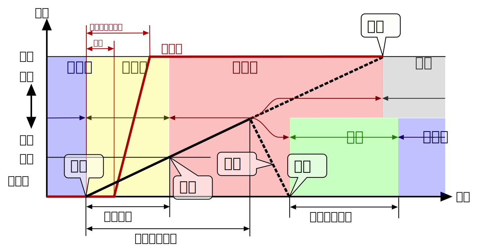

---

# SimEpidemic モデル仕様 ver. 1.7
著者：畝見達夫，作成：令和2年9月1日，編集：9月24日

この文書は個体ベース感染シミュレータ SimEpidemic に使われているモデルについて記述したものである。

## 世界の時空間モデル
シミュレーションの場となる世界は，連続値直行座標で位置を表現する正方形の2次元平面である。
初期状態では人口に対応する数の個体がランダムに配置される。
初期状態における個体の健康状態は，ランダムに選ばれた数人の未発症感染者を除き，
未感染であるものとする。
辺の長さと人口を調整することで人口密度を調整する。

シミュレーション過程は，まず，現在の状態での各個体の相互作用を計算し，
その結果と個体自身の状態に応じて次の状態を算出するというステップを繰り返すことで実現する。

-   パラメータ：世界の広さ，人口，初期の感染者数，1日あたりのステップ数，正方格子メッシュの数

## 個体の行動モデル
各個体は各ステップにおいて，周囲から受ける力ベクトルに従い移動する。
力には，周囲の個体との距離の２乗に反比例する斥力と周囲のもっとも好む個体への引力を合成して力のベクトルを計算し，
質量と摩擦係数を想定した積分の近似計算[^Integration]により次の位置を算出する。
世界の境界に隣接する場合は境界線からの斥力も受ける。
個体 $i$ が受ける力 $F_i$ は，
$$F_i = \alpha\cdot\sum_j\frac{p_i - p_j}{|p_i - p_j|^3}+\beta\cdot(p_b-p_i)$$
$p_i$ は個体 $i$ の位置，$b$ は周囲で最も好みの個体，$\alpha$ と $\beta$ は係数である[^Neighbours]。

### 長距離移動
発症していない個体は設定された確率で世界の領域内の別の位置に移動する。
対策としての移動制限は，この確率と距離を調整することで実現する。

### イベント・集会など
学校，職場，イベント，集会，さらに家庭など人が集まる現象を再現するモデルとして，
*集会* を確率的に発生される。個々の集会は円形の領域で．大きさ，持続時間，および，強さが割り当てらる。
集会の円周付近の発症していない個体は，集会の中心へ向かう力を受ける。力の大きさは円周上で最も強く，
そこからの距離に反比例して小さくなる。

-   パラメータ：斥力の強さ，移動頻度，移動距離の分布，集会の頻度，集会の大きさの分布，
集会の継続時間の分布，集会の強さの分布

[^Integration]: オイラー法を用いる。
[^Neighbours]: 2個体間の組み合わせをすべて計算せずに，あらかじめ定めた距離内にいる個体だけについて計算する。

## 発症機序
各個体の健康状態を 1. 未感染，2. 未発症，3. 発症，4. 快復，5. 死亡の５種類に分類する。
未感染の個体と未発症または発症の個体がある距離以内に近づくと，設定された確率で感染する。
感染した個体は個体に割り振られた速度で症状が進み，ある閾値を越えると発症し，
さらに次の閾値を越えると死亡する。
感染後，個体に割り振られた快復開始日数に達した個体は，症状が一定速度で快方に向かい，
感染前の健康状態に戻った時点で完治したとみなす。
快復した個体は免疫を獲得したものとみなされるが，
設定された期間を過ぎると免疫を失ったとみなし，未感染の状態にもどる。

感染者から他個体に感染する感染性の強さは，感染から完成性の遅れ期間を経るまでは 0 で，
その後ピーク到達期間と潜伏期間の短い方までは，時間経過に比例して強まる。

-   パラメータ：感染確率，感染可能な距離，潜伏期間の分布，快復開始までの期間の分布，
免疫有効期間の分布，感染性の遅れ，感染性のピーク到達期間

## 対策
社会的距離，移動の制限，隔離，接触者追跡を次節に述べる[検査](#Tests)とともに設定する。

1.  [行動モデルの節](#Behavior)で述べた他の個体との衝突回避の斥力の係数を変化させることで社会的距離を表現する。
パラメータとして，斥力の係数の増加率と要請への協力率を設定する。

2.  [行動モデルの節](#Behavior)で述べた他の場所への移動の距離と頻度を調整することで，移動制限を表現する。

3.  次節で述べる[検査](#Tests)の結果が陽性であった個体を隔離する。
隔離された個体は正解とは別に設けられた病院領域へ移動する。
隔離された個体が快復すると元の位置へ戻る。

4.  接触者追跡は，各ステップで感染可能な距離以内に近づいた別の個体を接触者として，
個体が持つリストに追記することで実現する。既にリストにある個体と再度接近した場合は，
過去の記録を消去し，新しい記録で書き換える。ただし，接触から14日を過ぎた記録は消去する。
接近したすべての個体を記録するのではなく，設定された確率により記録するかどうかが確率的に決まる。

-   パラメータ：社会的距離要請への協力率，陽性判明者の隔離率，接触者捕捉率，陽性判明から隔離までの日数

## 検査
検査の対象となる個体の選択方法と確率，検査の感度と特異度を設定する。
対象とする個体は，症状の出た個体，疑いのある個体，陽性の検査結果が判明した個体との接触者
の中から選ぶ。接触者以外の対象は設定された確率により選択する。
接触者の検査確率は，接触者の記録の確率に吸収できるので，別にパラメータを設けない。

-   パラメータ：発症者の検査率，未感染者中の疑い率，感度，特異度，検査から判明までの日数

## 分布パラメータの指定方法
潜伏期間や移動距離など分布の形式をとるパラメータは，
最小値，最大値，最頻値の３つの数値の組み合わせにより表現し，
その条件を満足するベル型の確率密度関数に従った擬似乱数発生により個々の場合の値を決める。

---
&copy; Tatsuo Unemi, 2020. All rights reserved.
